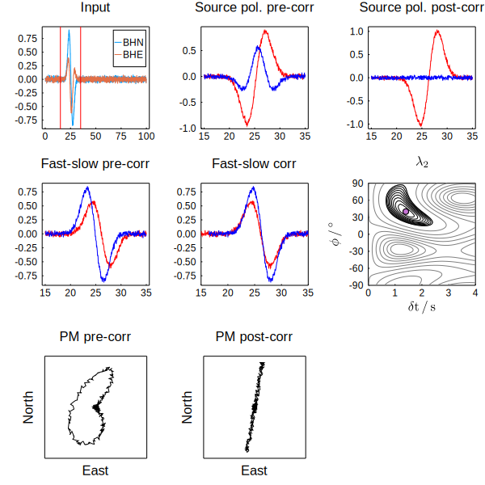

# SeisSplit

SeisSplit is a package for measuring shear wave splitting using the
minimum eigenvalue method of Silver & Chan (1991), as modified by
Walsh et al. (2013).

It uses the [Seis.jl](https://github.com/anowacki/Seis.jl) package which
provides fast, flexible seismic analysis.

Computation of splitting using the rotation-correlation method
(e.g., Bowman & Ando, 1987) is also possible.  This is computed
automatically by the main `splitting` function for quality control
purposes.

## Installing

```julia
julia> ] # Press ']' to get to package mode

(@v1.7) pkg> add https://github.com/anowacki/Geodesics.jl https://github.com/anowacki/Seis.jl https://github.com/anowacki/SeisSplit.jl
```

## Using

### Measuring shear wave splitting

The `splitting` function performs shear wave splitting analysis and returns a `SeisSplit.Result`
type containing information about the analysis.  Provide two `Seis.Trace`s, and
optionally specify the maximum delay time and number of fast orientation and delay
time analysis points.

We can show an example of using SeisSplit on some synthetic test data,
where the signal has had splitting of 1.4 s applied with a fast shear
wave orientation of 40°.  Looking at the result `s`, the values of `s.phi_best`
and `s.dt_best` show have recovered the expected splitting parameters:

```julia
julia> using Seis, SeisSplit

julia> data_dir = joinpath(dirname(pathof(SeisSplit)), "..", "test", "data");

julia> n, e = Seis.read_sac.(joinpath(data_dir, "wave.BH") .* ("N", "E"))
(Seis.Trace(.SWAV..BHN: delta=0.05, b=0.0, nsamples=1999), Seis.Trace(.SWAV..BHE: delta=0.05, b=0.0, nsamples=1999))

julia> s = splitting(n, e, 15, 35)
SeisSplit.Result{Float32,Vector{Float32}}:
            phi: -90.0:1.0:90.0
             dt: 0.0:0.1:4.0
           lam1: 181×41 Array{Float32,2}: [68.06532, ..., 68.06532]
           lam2: 181×41 Array{Float32,2}: [40.643196, ..., 40.643196]
       phi_best: 40.0 °
           dphi: 0.5 °
        dt_best: 1.4 s
            ddt: 0.025 s
           spol: 10.00806 °
          dspol: 0.22093524 °
         trace1: Seis.Trace(.SWAV..BHN: delta=0.05, b=0.0, nsamples=1999)
         trace2: Seis.Trace(.SWAV..BHE: delta=0.05, b=0.0, nsamples=1999)
   window_start: 15 s
     window_end: 35 s
            ndf: 302
      xcorr_phi: 90 Array{Float64,1}: [-90.0, ..., -88.0]
       xcorr_dt: 81 Array{Float32,1}: [0.0, ..., 0.05]
      xcorr_map: 81×90 Array{Float32,2}: [0.48693663, ..., 0.5155819]
 xcorr_phi_best: 42.0 °
  xcorr_dt_best: 1.35 s
reference_frame: geographic
```

The following is the docstring for the `splitting` function:

```
    splitting(t1, t2, window_start=starttime(t1), window_end=endtime(t1); nphi=$SPLIT_NPHI, ndt=$SPLIT_NDT, dt_max=$SPLIT_DT_MAX, xcorr=true) -> results

Perform a search over a pair of Seis traces, `t1` and `t2`, for the smallest value of the
minimum eigenvalue of the covariance matrix between the traces, for a set of `nphi`×`ndt`
shear wave splitting operators, up to `dt_max` s.

## Output

`results` is a `SeisSplit.Result` containing:

- `phi`: The set of fast shear wave orientations (°)
- `dt`: The set of delays times (s)
- `lam1`: The larger eigenvalues at each [phi,dt] point
- `lam2`: The smaller eigenvalues at each point
- `phi_best` and `dphi`: The best ϕ and its 1σ uncertainty (°).  ϕ is measured
  clockwise from local north (towards east) if both input traces are horizontal;
  otherwise the angle is measured from `t1` to `t2`.
- `dt_best` and `ddt`: The best δt and its 1σ uncertainty (s)
- `spol` and `dspol`: The source polarisation and an estimate of its uncertainty for the
  best-fitting ϕ and δt (°).  `spol` is given with the same convention as `phi_best`.
- `trace1` and `trace2`: The original input traces, where `trace2` is clockwise of `trace1`
  if both are horizontal, and they are `t1` and `t2` otherwise.
- `window_start`, `window_end`: The analysis time window end points (s)
- `ndf`: The number of degrees of freedom in the signal
- `reference_frame`: A record of whether the fast orientation and polarisation
  represent the azimuth from north (`:geographic`) or simply the angle
  from the first trace to the second (`:trace`).

If `xcorr` is `true`, then the rotation correlation map for the pair
of traces is also computed and the following additional fields are
present in `results`:

- `xcorr_phi`: Angles over which rotation correlation was calculated (°)
- `xcorr_dt`: Delay times over which rotation correlation was calculated (s)
- `xcorr_map`: Cross correlation at each [phi,dt] point
- `xcorr_phi_best`: Fast orientation of maximum cross correlation (°)
- `xcorr_dt_best`: Delay time of maximum cross correlation (s)
```

### Plotting results

You can create a diagnostic plot of a `SeisSplit.Result` by loading
[`Plots.jl`](https://github.com/JuliaPlots/Plots.jl) and calling `plot()` on the result:

```julia
julia> using Plots

julia> plot(s)
```



(Note that Plots.jl must be included in the current environment; if it
is not, then simply do `import Pkg; Pkg.add("Plots")` first.)

### Result quality

Several common measures of the quality of a shear wave splitting `Result`
`s` are available:

- `quality(s)` gives the _Q_ value of Wuestefeld et al. (2010) to determing
  how good, poor or null a measurement is.
- `snr_restivo_helffrich(s)` gives the signal-to-noise ratio of the result,
  per Restivo & Helffrich (1999).
- `lam1_ratio` `lam2_ratio` and `lam_ratio` return ratios of the minimum
  or maximum λ₁ and λ₂ to the value of the uncorrected window.  (λ₁ and λ₂
  are the larger and smaller eigenvalues of the covariance matrix of the
  particle motion after correcting for the best-fitting splitting
  parameters.)


## Contributing

To report a bug, please
[open an issue](https://github.com/anowacki/SeisSplit.jl/issues/new) and
provide as much detail as possible to reproduce the bug.  Ideally this
should be in the form of some code representing a
minimal non-working example ([MWE](https://stackoverflow.com/help/minimal-reproducible-example)), but all reports are welcome.  I will
try and fix any bugs that are reported, but please note that this may
not be very quickly, depending on my other commitments.

Pull requests (especially if they implement bug fixes) are very welcome.
Feature requests will be seriously considered.  Please make sure that
new code comes with tests, and that all tests pass with your addition.


## References

- Bowman, J. R., Ando, M., 1987. Shear-wave splitting in the
  upper-mantle wedge above the Tonga subduction zone.  Geophys J R
  Astr Soc 88, 25–41.
  doi:[10.1111/j.1365-246X.1987.tb01367.x](https://doi.org/10.1111/j.1365-246X.1987.tb01367.x)
- Restivo, A., Helffrich, G., 1999. Teleseismic shear wave splitting
  measurements in noisy environments. Geophys J Int 137, 821–830.
  doi:[10.1046/j.1365-246x.1999.00845.x](https://doi.org/10.1046/j.1365-246x.1999.00845.x)
- Silver, P.G., Chan, W.W., 1991. Shear-wave splitting and subcontinental mantle
  deformation. J Geophys Res-Sol Ea 96, 16429–16454.
  doi:[10.1029/91JB00899](https://doi.org/10.1029/91JB00899)
- Walsh, E., Arnold, R., Savage, M.K., 2013. Silver and Chan revisited.
  Journal of Geophysical Research: Solid Earth 118, 5500–5515.
  doi:[10.1002/jgrb.50386](https://doi.org/10.1002/jgrb.50386)
- Wuestefeld, A., Al-Harrasi, O., Verdon, J.P., Wookey, J., Kendall, J.-M., 2010.
  A strategy for automated analysis of passive microseismic data to image
  seismic anisotropy and fracture characteristics.
  Geophysical Prospecting 58, 753–771.
  doi:[10.1111/j.1365-2478.2010.00891.x](https://doi.org/10.1111/j.1365-2478.2010.00891.x)

